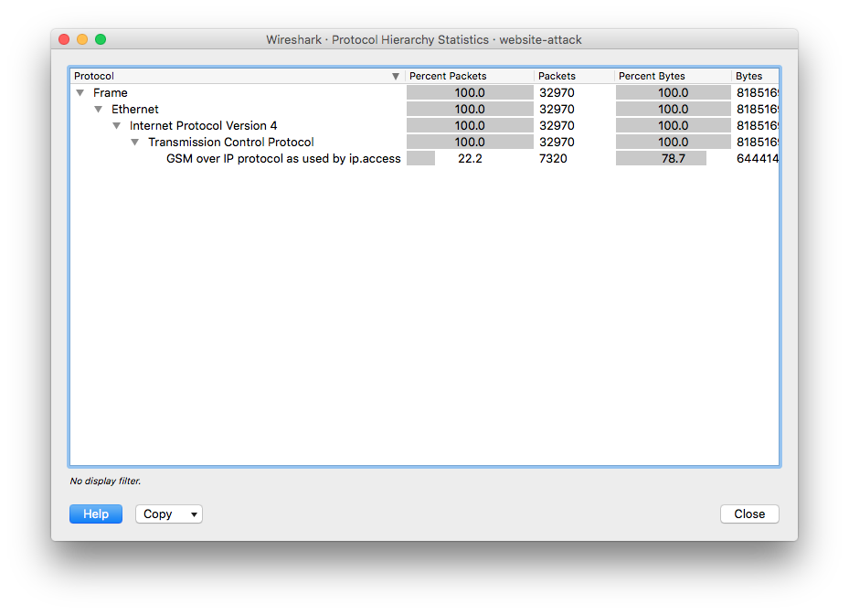
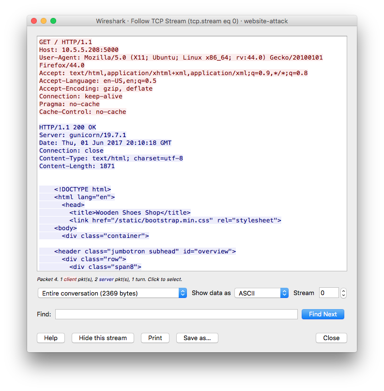

# SHA2017 CTF - Network challenge (Network attack)

_Small print: I solved this challenge for the OpenToAll CTF team._

Opening the PCAP with Wireshark and looking at the Protocol Hierarchy, we see that the full PCAP is GSM over IP protocol. 



Selecting these GSM IPA packets and following the stream we see that it's just good old HTTP traffic, which we can easily handle.



Looking at the first HTTP GET requests and responses gives us this:
```
GET /?action=search&words=kl&sort=stock HTTP/1.1
<snip>

HTTP/1.1 302 FOUND
<snip>
Location: http://10.5.5.208:5000/?action=display&what=ce3926706794d911

GET /?action=display&what=ce3926706794d911 HTTP/1.1
<snip>

GET /?action=search&words=Trad&sort=stock HTTP/1.1
<snip>

HTTP/1.1 302 FOUND
<snip>
Location: http://10.5.5.208:5000/?action=display&what=f1274d671988ce151a0b

GET /?action=display&what=f1274d671988ce151a0b HTTP/1.1
<snip>

HTTP/1.1 200 OK
<snip>............................. shows only the Traditional klomp.....

GET /?action=search&words=-Trad&sort=stock HTTP/1.1
<snip>

HTTP/1.1 200 OK
<snip>
Please use only letters and digits

GET /?action=search&words=AAAAAAAAAAAAAAAAAAAAAAAAAAAAAAAAAAAAAAAAAAAAAAAAAAAAAAAAAAAAAAAAAAAAAAAAAAAAAAAAAAAAAAAAAAAAAAAAAAAAAAAAAAAAAAAAAAAAAAAAAAAAAAAAAAAAAAAAAAAAAAAAA&sort=stock HTTP/1.1
<snip>

HTTP/1.1 302 FOUND
<snip>
Location: http://10.5.5.208:5000/?action=display&what=e4146d4252bafb3b38212df186497a7479d5e95af4796e7573a65e6849952032e4146d4252bafb3b38212df186497a7479d5e95af4796e7573a65e6849952032e4146d4252bafb3b38212df186497a7479d5e95af4796e7573a65e6849952032e4146d4252bafb3b38212df186497a7479d5e95af4796e7573a65e6849952032e4146d4252bafb3b38212df186497a74799edb6fda5b44
```

So we see some HTTP requests to filter the results (action=search) and a redirect (action=display) with a cryptic "what" parameter to go to the results page.

The first idea I got was immediately the correct one. XORing the input with the cryptic hex output gives us the XOR key:
```
koffiedrinker$ perl -MPwn::Crypto -e 'print fixed_xor(hr("e4146d4252bafb3b38212df186497a7479d5e95af4796e7573a65e6849952032e4146d4252bafb3b38212df186497a7479d5e95af4796e7573a65e6849952032e4146d4252bafb3b38212df186497a7479d5e95af4796e7573a65e6849952032e4146d4252bafb3b38212df186497a7479d5e95af4796e7573a65e6849952032e4146d4252bafb3b38212df186497a74799edb6fda5b44"), "AAAAAAAAAAAAAAAAAAAAAAAAAAAAAAAAAAAAAAAAAAAAAAAAAAAAAAAAAAAAAAAAAAAAAAAAAAAAAAAAAAAAAAAAAAAAAAAAAAAAAAAAAAAAAAAAAAAAAAAAAAAAAAAAAAAAAAAAAAAAAAAAA")'
Pwn::Crypto::XOR::fixed_xor(): strings do not have equal length...
koffiedrinker$  # Padding 6 bytes to the input...
koffiedrinker$ perl -MPwn::Crypto -e 'print rh(fixed_xor(hr("e4146d4252bafb3b38212df186497a7479d5e95af4796e7573a65e6849952032e4146d4252bafb3b38212df186497a7479d5e95af4796e7573a65e6849952032e4146d4252bafb3b38212df186497a7479d5e95af4796e7573a65e6849952032e4146d4252bafb3b38212df186497a7479d5e95af4796e7573a65e6849952032e4146d4252bafb3b38212df186497a74799edb6fda5b44"), "AAAAAAAAAAAAAAAAAAAAAAAAAAAAAAAAAAAAAAAAAAAAAAAAAAAAAAAAAAAAAAAAAAAAAAAAAAAAAAAAAAAAAAAAAAAAAAAAAAAAAAAAAAAAAAAAAAAAAAAAAAAAAAAAAAAAAAAAAAAAAAAAAAAAAAA")) . "\n"'
a5552c0313fbba7a79606cb0c7083b353894a81bb5382f3432e71f2908d46173a5552c0313fbba7a79606cb0c7083b353894a81bb5382f3432e71f2908d46173a5552c0313fbba7a79606cb0c7083b353894a81bb5382f3432e71f2908d46173a5552c0313fbba7a79606cb0c7083b353894a81bb5382f3432e71f2908d46173a5552c0313fbba7a79606cb0c7083b3538df9a2e9b1a05
```

Because we have the XOR key and other plaintext and ciphertext, I was able to determine that the full plaintext is the value of the "words" parameter, a newline and the value of the "sort" parameter (which explains the six extra bytes of input I needed to match the hexstring length). So for example, searching for Trad gave us "f1274d671988ce151a0b". The plaintext that generates this is:
```
Trad\x0astock
```

Now we just extract all the GET requests from the PCAP, XOR it with our key and see what we got. I used a quick Perl one-liner for this:
```
koffiedrinker$ strings website-attack.pcap | grep 'GET /?action=display&what=' | perl -nle '/what=(\w+)\s/; print $1' > what.txt
```

A quick Perl script later:
```perl
use strict;
use warnings;

use Pwn::Crypto;

my $long = hr("e4146d4252bafb3b38212df186497a7479d5e95af4796e7573a65e6849952032e4146d4252bafb3b38212df186497a7479d5e95af4796e7573a65e6849952032e4146d4252bafb3b38212df186497a7479d5e95af4796e7573a65e6849952032e4146d4252bafb3b38212df186497a7479d5e95af4796e7573a65e6849952032e4146d4252bafb3b38212df186497a74799edb6fda5b44");
my $aaa = "AAAAAAAAAAAAAAAAAAAAAAAAAAAAAAAAAAAAAAAAAAAAAAAAAAAAAAAAAAAAAAAAAAAAAAAAAAAAAAAAAAAAAAAAAAAAAAAAAAAAAAAAAAAAAAAAAAAAAAAAAAAAAAAAAAAAAAAAAAAAAAAAA\x0astock";
my $key = fixed_xor($aaa, $long);
print "Key: " . rh($key) . "\n";
open(WHAT, 'what.txt');
while(<WHAT>) {
	chomp;
	my $query = hr($_);
	my $trimmed_key = $key;
	if(length($query) < length($key)) {
		# We can trim it
		$trimmed_key = substr $key, 0, length($query);
	} else {
		print "Woah! Query is longer than key!\n";
		die "Bluh\n";
	}
	print "Result: " . fixed_xor($query, $trimmed_key) . "\n";
}

```

Let's see what that gives us...
```
koffiedrinker$ perl network.pl 
Key: a5552c0313fbba7a79606cb0c7083b353894a81bb5382f3432e71f2908d46173a5552c0313fbba7a79606cb0c7083b353894a81bb5382f3432e71f2908d46173a5552c0313fbba7a79606cb0c7083b353894a81bb5382f3432e71f2908d46173a5552c0313fbba7a79606cb0c7083b353894a81bb5382f3432e71f2908d46173a5552c0313fbba7a79606cb0c7083b353894a81bb5382f
Result: 
(CASE WHEN (SELECT SUBSTR(sql,1,1) FROM  SQLITE_MASTER LIMIT 1,1) = '0' THEN stock ELSE price END)
Result: 
(CASE WHEN (SELECT SUBSTR(sql,1,1) FROM  SQLITE_MASTER LIMIT 1,1) = '1' THEN stock ELSE price END)
Result: 
(CASE WHEN (SELECT SUBSTR(sql,1,1) FROM  SQLITE_MASTER LIMIT 1,1) = '2' THEN stock ELSE price END)
Result: 
(CASE WHEN (SELECT SUBSTR(sql,1,1) FROM  SQLITE_MASTER LIMIT 1,1) = '3' THEN stock ELSE price END)
Result: 
(CASE WHEN (SELECT SUBSTR(sql,1,1) FROM  SQLITE_MASTER LIMIT 1,1) = '4' THEN stock ELSE price END)
Result: 
(CASE WHEN (SELECT SUBSTR(sql,1,1) FROM  SQLITE_MASTER LIMIT 1,1) = '5' THEN stock ELSE price END)
```

So we are dealing with a SQLinjection attack on the webserver. It's easy to find the flag from this output. We just wait until the attacker goes to the next character in SUBSTR and get the character from the line above it.

For example:
```
Result: 
(CASE WHEN (SELECT SUBSTR(sql,1,1) FROM  SQLITE_MASTER LIMIT 1,1) = 'C' THEN stock ELSE price END)
Result: 
(CASE WHEN (SELECT SUBSTR(sql,2,1) FROM  SQLITE_MASTER LIMIT 1,1) = '0' THEN stock ELSE price END)
```

So the first character that matched what the attacker wanted is a 'C'.

Coding this gives us the flag:
```perl
use strict;
use warnings;

use Pwn::Crypto;

my $long = hr("e4146d4252bafb3b38212df186497a7479d5e95af4796e7573a65e6849952032e4146d4252bafb3b38212df186497a7479d5e95af4796e7573a65e6849952032e4146d4252bafb3b38212df186497a7479d5e95af4796e7573a65e6849952032e4146d4252bafb3b38212df186497a7479d5e95af4796e7573a65e6849952032e4146d4252bafb3b38212df186497a74799edb6fda5b44");
my $aaa = "AAAAAAAAAAAAAAAAAAAAAAAAAAAAAAAAAAAAAAAAAAAAAAAAAAAAAAAAAAAAAAAAAAAAAAAAAAAAAAAAAAAAAAAAAAAAAAAAAAAAAAAAAAAAAAAAAAAAAAAAAAAAAAAAAAAAAAAAAAAAAAAAA\x0astock";
my $key = fixed_xor($aaa, $long);
print "Key: " . rh($key) . "\n";

my $previous_str = '';
my $first_one = 1;
my $flag = '';
open(WHAT, 'what.txt');
while(<WHAT>) {
	chomp;
	my $query = hr($_);
	my $trimmed_key = $key;
	if(length($query) < length($key)) {
		# We can trim it
		$trimmed_key = substr $key, 0, length($query);
	} else {
		print "Woah! Query is longer than key!\n";
		die "Bluh\n";
	}
	my $r = fixed_xor($query, $trimmed_key);
	print "Result: $r\n";
	if(!$first_one) { # Compare with previous one
		$previous_str =~ /SUBSTR\(([^\)]+)\)/;
		my $prev = $1;
		$r =~ /SUBSTR\(([^\)]+)\)/;
		my $cur = $1;
		if($prev ne $cur) {
			print "Different! $prev != $cur \n";
			$previous_str =~ /\= \'(.)\' THEN stock/;
			$flag .= $1;
		}
	}

	$previous_str = $r;
	$first_one = 0 if $first_one;
}

print "FLAG: $flag\n";
```

Running it:
```
koffiedrinker$ perl network.pl
FLAG: CREATE TABLE secret_flag (flag text)


                                          flag{7307e3ee8da198ca4a7f9b1f8b018d8e}
```

Flag: flag{7307e3ee8da198ca4a7f9b1f8b018d8e}
