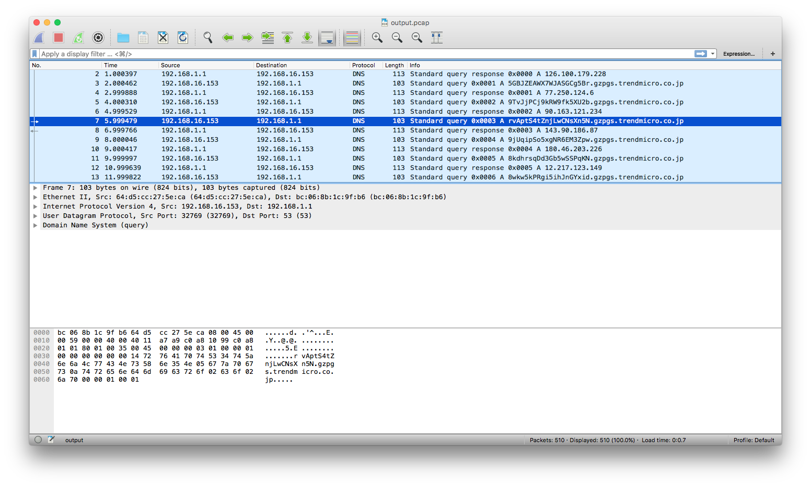

# For 100

Opening the PCAP file in Wireshark, we are presented with hundreds of DNS queries and responses.



After looking inside the DNS queries, I did not notice any weird values except for the query. So I extracted all queries and responses with Scapy.

```python
from scapy.all import *
from binascii import unhexlify
import re

pcap = PcapReader("output.pcap")
for packet in pcap:
	if packet[DNS].ancount > 0:
		for answer in packet[DNS].an:
			print "Answer: " + answer.rdata 
	else: # Query
		query = packet[DNSQR].qname
		p = re.match('([a-zA-Z0-9]+)\.gzpgs\..*', query)
		print("Query: " + p.group(1))
```

This gives us something that looks like:
```
Query: ASfsbGivEQsT2aQPHzaB
Answer: 126.100.179.228
Query: 5GBJZEAWX7WJASGCg5Br
Answer: 77.250.124.6
Query: 9TvJjPCj9kRW9fk5XU2b
Answer: 90.163.121.234
Query: rvAptS4tZnjLwCNsXn5N
Answer: 143.90.186.87
Query: 9jUqipSo5xgNR6EM3Zpw
Answer: 180.46.203.226
...
```

I noticed that the IP addresses were probably bogus or auto-generated because the output contains invalid IP addresses. After try-and-error, I concatenated all the queries together, since all queries are the same length except for the last one which indicated that it might be the remainder of some file or text.

```
koffiedrinker$ perl -ne 'chomp;s/^Query: (.+)$/$1/;print if ! /Answer: /} END {print "\n"' for100/parsed_output.txt 
ASfsbGivEQsT2aQPHzaB5GBJZEAWX7WJASGCg5Br9TvJjPCj9kRW9fk5XU2brvAptS4tZnjLwCNsXn5N9jUqipSo5xgNR6EM3Zpw8kdhrsqDd3Gb5wSSPqKN8wkw5kPRgi5ihJnGYxidp7vfcECXgiGtisBnZiD9C2kv3MzxMXGZiSgQpfmty3vYWgxkk9ygyqJcRDnDPB2gk8K9SJFcKrPimJja9REhmzgECtjmEMYVz5QYtsHgSBzRBT8FbQx3mvpXjEkoi86dM8n9eQuZ38wj8Jvg2HSvjr8qyEtur3E5vPfFiANqqbY4J4jbCyNrUrJLW8fGVvr9mdAyAqpJsk8h9X8t1LtyXV2cMoxaj2ELd8EoY3aGDatsba5mVkNwpptkVumdo8sxXoYSta6fKKAC3MXfLVvkHYSsGs9fnyXPMgitffJ49xt4oCxCHtyoWgytH6sudYPkSypJUuCWfsS1R771e95ReRvie3RgQjEwpVL4HsnCEJeEEzPWVtJQpTcheGGBsMzqMuR3y8eui2wU93H5ZeDVauv4qQYPWdpub8YsJ9X3mQCZ7B4XsdyTUSyTgoeboTbqpATAnuCDRzYnpd6sQ5PggQBdoUYjABcPHgUp34UmzHSGaRScoHzFT8W51c8iY3X6uNCxRwnZLCx2C4PBwZN24wKWFAoLvSTGaeVcxBQ3UHo9xpY5HoHJaL1pPaxAhFhei73H5k5doyAoKhvTdvNehEhJocCoxRZKbBQP8f7cZgTmCuD1ekRNQ6o7ZysnuDwfvvmotn9Wap7DeGZGnS94g7wUSB4B7VUcSEcT9G18yYuKh8fjBAw9fJrrgZmZ97FnKJWgXf9Ju9648DDBgh534XrjqMLiBXFq2dnfqmG845ndTuXSR1bMRpqpjFeJN52D9KKKaYqTgoCqo9Y1nt9pwahd3v1srMpjVTPt46SH2RKU21ZfiqENof8hkgxxLTLtkWPRPJeB9WSVGzALTZ3L8QVsq1uXHwUKYkmjbX71PhrzfnhzV5ffFCtjiuF1D4gtMY1cf9ieUzKWF7voscgM2zcVoiDdYCfpKJGrkzpDZB1cQTPDZYyLbzZ9hE2B1RAwV7e4NGuG8TPQmaXvet3rZe3Q7zZhmcdXhwbd8Et7JZHcvidkLCb1JDrNe1dX6fjddFonVfoMWNcAHLH5BypDgNtAwK2JkABnkMAsBQi16XaNToXzTC4Ug8UNgyUfRjXrwzTYckVfE7Voe5kdwYLX4FQ12eQm3BbW76tkfsZUUAm3gHHk3roTCiQ8kNejjitLaRVhfeuGyfMkotR8TVmYPGqEmcS1qRMWJmigBwg7ZbG4hSDCdSq83eKsFyig8A4EDsPFXnGKAgUe1UYHvzahFBhneyhgmfdbheRAEAkMqVn5PBmEhv7bC4aNUZ465Hus2JpJF5L4tkfbJsAVmCrtREhCuLhUqXqVmFBqknhox2BfRQqAZMB6f4udU3XoU4qED1V5kEqA1qVGytjWB2pQGbjuacAjf2C8n7QSUTJhFsrmQp12sUE7WJ6wtTg4bnjNDzyHbJSiVWhr2EuES8qZbVFP5478HpVh8dpCvz6DJJybAEfcsg76pGLBatEMvjiHTC5LhdAfPbQiePVedCjEQL21Pn6iGLTPZfWqHVz3ZtkR4iDFZyn3L5ZGWjCJ3JgzCTRmYeuXfW2XcNMipgv4c97i8TAbL3m5rhV5ShtjBAqwdfszh1erSpVDMuijNpo2sC6czF2fq6mGMKe8hwWoBwVt7sRaAYtp94AEw5AJHUdvfRzsQ7XBMQBMDHbpmCkWortnVk1krAVUK8MfGQezUgvSmX6pBgXDrGkxyNmWpQg8DeF5saQApGKMzshqTmGrrJm7s4TYajBsRKatfjKBLgto6YHd548ALADReAEmymFbDg31U6dJPp1XbHujeMe3z2QQqmftAz2LRpfjz6Rh64cVRK6DadBBsL9quZoiZB339vLDMx4xRRaU7N5NxSnPz4ZjuYm4V2uUoTmA4jaS7atSzbEBujiVf2wTz18ymbPFapXrc53WNL9iYa7nqHUAgvn1Bx9L5hadd5A97ss2NhSPmwZGBu7rj2f43uwfdGamzZpGxEascuGT48p9wgm49Ck6QovrCj7g3KAZXEopDkmeReSRNkEipH2U4V7Vim425LAJsghg1nqXDRHx4QNAe9TKBiRYPw2wPdPi9gWHPpnwHJyX896ErCvXadRfQrEuushKthcnvUyUXt8MZWcHLujDkKFqhama3vxFTDH7N8QD5KchNevv7KPDo95DagyyZHGyLT7DKEusvJ8SZuodBEeWwwJ1qfCMasEBBiPXov6hUexhazHeJRTEVscjZ2bNiScQs2YuqPnej26QShcrwwyunJZu2S9yqo7i6PsfpWXAmZcQ7Nba7QpAfaH4NuGnhzUb9KcVZmJkfRzgD3egFR9C79gQYybVMpd6Kxz5xRzS4WAhLLdqwUFxNBw3hUV7nMywSR6Cg2ajnv61ZWVNgAofwXuthzfGkAyae51WNWjtbtpCSEQLPY1uTwWZ13bthQaoCeZ53nomwgWB4EBaimmu78qnAquqjeCw73XK4UXGR61THLxgSiuGjRRcj6489cuWfQ7gyU6ckPo6QL8cGPvHj6CXJ4w8CakQMmwq7JGpPToD826chKGtH5A2RKCkHc7NQA79MvHvXdtByDC4iPaivSRmLXZa5W8vr4F7JqbK8ghZcQJuSGWTaQwQjjABhkmWvDvs6HHyW3j8XK6cPijnTVvCgDN63NrmsuNkMCnbkiWRZfgu8pqckVze5LxGnVWPmtmnVv4unssrKhd1SBPU17vps76MiHontgDCbfxtp9BZFt8EYtZMUghzzxQxTKFGGg9bL6eRrrFfjYx15E4GtAmZ5wZA5oxE8atxtdaWc1qfQ7wMMvzR8QHx5Xw7imGXh4M58Kiknsw7urRDkitH2EAxKPLsbp4eAERFFNT3Vy6XdymAGGkok1KcM5EWWSpdEjWJpdi36dYsXCTrbLYqXuMFHViL5GP9HFJhMez6hsvcsscaLUUz3KhWD9owzzczVAk8GzDkkrT1Sqxs6oG3Q6isAHUAVYUbiRaqm3AjSazJf5BsA6Xxxc9LV25nKvTKjK6Q4UEXWvMnEM5iKTmwWsoHvGB4EnNNN34f9mfavgdTfG9WovwysP4AxHK4iHipuv5mto1ugHG2vFgVafweSaFh63qhYqEc9HHmJaFRJ8bSJBLBEi9LKmsDCufc6u6FQCshYApRFKKGYWEgMaWABHSLEfwA8KrZyF2WhbyuNiskF6RWVJMpBX2g7oqUj3W73H4E5ybHUqQx5HeKpPgDFSxRMtVCee8U5KmUXDPDFHEY9ayoDGE3P6UMMu6u4GPwMxoT8r2hKrZigMvngG5ujwKm5FCX1DQNPAdzTtQPMuVfNSq5YL8njRpT1UFDWFV6PQ616hX392iTiMQbNN41VgKE1Zp54qG3nYK6DJCG1yssE71HxYudvTV2vRdx4kLQvMLc7UPfCfjswRxptxyffRcMNV4fpnSXHKVKVNo7rnmbZjyAgQmNiA4tG2yaVLqKQ6mdzH914mH7inV9keb4evbazKxFhumbhtKr4YAm7VqUxTiwGrqcsdg9XwHuwZG69BmoRkhJhVFRkxe2qSQGrk6qGMP4MPKYZXzCJEU14sq3rGEU23avuKUjCPcEVcMboGvjH6N7TG8zgQmnhrXaDQVqQ6dBiGwg3eESUiXFQxZLZFecXiu1gHG7p75QCedSV5EEwdpyEL1rJWTji8WvAKDGpkqXKDxJPQW78DmTtdVDNWgEVqkBRKp4HiYcSV3WZ71vpm6LzkEW7UyoQnF3AfcVuFp4ogxeA9vPzZ3LoVFSts9CYgPxJW8i2KpUW1bPitDsYqqr6tK3wvLW3CWdzWrDWowzgSoFHZQ6EqiLpfVbfuvj5FyURHsmDecGFnnAdBFckx6hJeuagNNbK4iyT9KfPDUPoGXprsGcpeVY9SRU3nMVjuFB22ziqZxPwASjebDepePoe3LbTDwK8XFTx8JaKr5xXyGkw7cqBCzvhVWQvkRjyWhFYmfRc3S2814fatrghk9CphAcHkLfNhvU9yUmsDmwWpUXQH9ZnxUPRDVN3oEJhvG5ptZF9YJtSQdKATnif7Ut2tis18xaKdiARRi2cQiD1GTtd7NFtq9TxNmL7C2vQNGneNpGJPWb9mZMG3g4CCHaunsKyXExXL9yEjBwHq6H9unt9wAiCGVH32mvVRZbLMF4CpWRiqW8nVqCx4PpCdopakRUqZfX2iEJ4UKtU4CEYUMH23sB2XSeveHgoNtTZvaziunDXHMHSTJe3VKYRy4JQSs3W3xe3apFCkwS33mea2gfgiqwhGTifa2QAjgGsdae1RejMC5dqWjAMfXMmC6mA3b5DEDZAP5XgJqi6vZMSho8CNWQAZ1xD2RKGyCr8gCx1zsfpuL5ffFmzC7KrzZ9ZxoWRHrnWmS9E5rsgtGRn5kMtVe8jnYXZeoVxYt7uvFeLjXRfmaDXt7SmD5pz9nNwXTqZ1WhUN743CFUCeMD2ZFpT68gme2TiT17Fhwuh1EQekVwxDrQsTD2tRh3PHRatw49h9vi4FUyNnh3BJwuq9UykbJ7kq9faJQxuJiwxWRUBD9TK9G9dBn1AhcDwogPyqU3rFneZ37FL56NvaPXgVLX7d2wY7JbrzuY3SHhjECWyFWGBSpGurNmCUFf4a9bLvH8xnKXyPpLjNyBcsPTaXET3299mhHaXKTpBApDbukmRnpMkwqUJyQAvhxqiDRkrZTfKYws43sfzfabxEEWL6uaSZLTjze8avxqtDemvaPgjfMcfvqvjz66UAnraPLbymzo9PL5imY26LPinAGSJi6q3oSPAvYgboMWbDWrNbsS56v64KBaiLS28qQWdL5t3ADvL5eCR1EDEDzx74zYL3WVNcJenBQFprxj7U4hzDm22edMxLpR5daeYKmKtTcjEanULv6obrrXW5JWbEoKn4qGpatrf76fKwKMZnvwxUhz3iSLkfZQLgQoJHWvzVCRE7e7GmJwgLPri45ctU4WNuN72W8UyWzGTK
```

Since base64 decoding failed, I checked if the output did not contain any of the following characters which would indicate base58:

> Compared to Base64, the following similar-looking letters are omitted: 0 (zero), O (capital o), I (capital i) and l (lower case L) as well as the non-alphanumeric characters + (plus) and / (slash).
Source: [Wikipedia](https://en.wikipedia.org/wiki/Base58)

And what do you know, it doesn't. A quick google leads us to an [online base58 decoder](https://www.browserling.com/tools/base58-decode) and the text decodes as the hacker manifesto with the flag:
```
==Phrack Inc.==

                    Volume One, Issue 7, Phile 3 of 10

=-=-=-=-=-=-=-=-=-=-=-=-=-=-=-=-=-=-=-=-=-=-=-=-=-=-=-=-=-=-=-=-=-=-=-=-=-=-=-=
The following was written shortly after my arrest...

                       \/\The Conscience of a Hacker/\/

                                      by

                               +++The Mentor+++

                          Written on January 8, 1986
=-=-=-=-=-=-=-=-=-=-=-=-=-=-=-=-=-=-=-=-=-=-=-=-=-=-=-=-=-=-=-=-=-=-=-=-=-=-=-=

        Another one got caught today, it's all over the papers.  "Teenager
Arrested in Computer Crime Scandal", "Hacker Arrested after Bank Tampering"...
        Damn kids.  They're all alike.

        But did you, in your three-piece psychology and 1950's technobrain,
ever take a look behind the eyes of the hacker?  Did you ever wonder what
made him tick, what forces shaped him, what may have molded him?
        I am a hacker, enter my world...
        Mine is a world that begins with school... I'm smarter than most of
the other kids, this crap they teach us bores me...
        Damn underachiever.  They're all alike.

        I'm in junior high or high school.  I've listened to teachers explain
for the fifteenth time how to reduce a fraction.  I understand it.  "No, Ms.
Smith, I didn't show my work.  I did it in my head..."
        Damn kid.  Probably copied it.  They're all alike.

        I made a discovery today.  I found a computer.  Wait a second, this is
cool.  It does what I want it to.  If it makes a mistake, it's because I
screwed it up.  Not because it doesn't like me...
                Or feels threatened by me...
                Or thinks I'm a smart ass...
                Or doesn't like teaching and shouldn't be here...
        Damn kid.  All he does is play games.  They're all alike.

        And then it happened... a door opened to a world... rushing through
the phone line like heroin through an addict's veins, an electronic pulse is
sent out, a refuge from the day-to-day incompetencies is sought... a board is
found.
        "This is it... this is where I belong..."
        I know everyone here... even if I've never met them, never talked to
them, may never hear from them again... I know you all...
        Damn kid.  Tying up the phone line again.  They're all alike...

        You bet your ass we're all alike... we've been spoon-fed baby food at
school when we hungered for steak... the bits of meat that you did let slip
through were pre-chewed and tasteless.  We've been dominated by sadists, or
ignored by the apathetic.  The few that had something to teach found us will-
ing pupils, but those few are like drops of water in the desert.

        This is our world now... the world of the electron and the switch, the
beauty of the baud.  We make use of a service already existing without paying
for what could be dirt-cheap if it wasn't run by profiteering gluttons, and
you call us criminals.  We explore... and you call us criminals.  We seek
after knowledge... and you call us criminals.  We exist without skin color,
without nationality, without religious bias... and you call us criminals.
You build atomic bombs, you wage wars, you murder, cheat, and lie to us
and try to make us believe it's for our own good, yet we're the criminals.

        Yes, I am a criminal.  My crime is that of curiosity.  My crime is
that of judging people by what they say and think, not what they look like.
My crime is that of outsmarting you, something that you will never forgive me
for.

        I am a hacker, and this is my manifesto.  You may stop this individual,
but you can't stop us all... after all, we're all alike.

                               +++The Mentor+++

TMCTF{DNSTunnelExfil}

```

Flag: TMCTF{DNSTunnelExfil}
